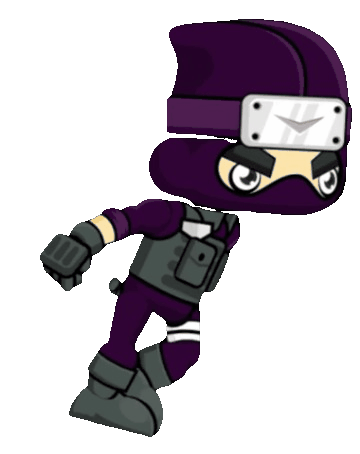
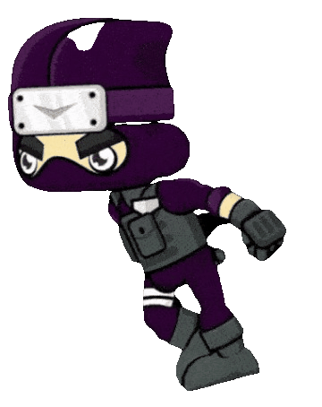
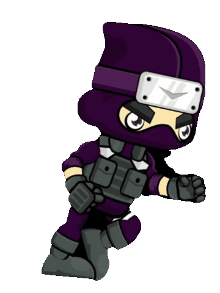
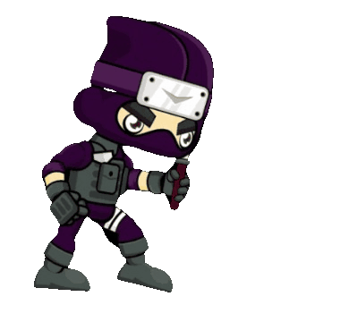
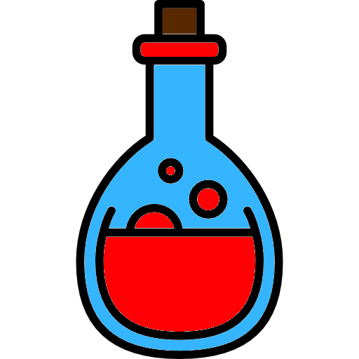
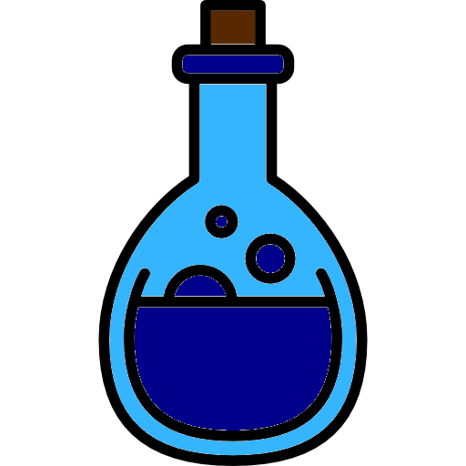
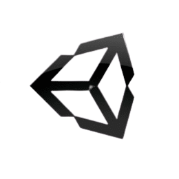

<table align="center"><tr><td align="center" width="5000">

</table>

The Last Taco
===================

Une malédiction est survenue dans le monde du fast-food. Le tacos français est en voie de disparition et vous seul pouvez mettre fin à ce désaste.
Incarnez un ninja et parcourez 4 pays pour découvrir la gastronomie :
-   Le Japon :jp: avec ses sushis  :sushi: et ses nouilles :ramen:
-  L'Italie :it: con pasta :spaghetti: e pizze :pizza:
-   Les États-Unis :us: with hamburgers :hamburger: and donuts :doughnut:
-	Le Mexique 🇲🇽  con sus tacos :taco: y sus pimientos :hot_pepper:

----------
[[_TOC_]]

Installation
-------------

#### :penguin: </i> Linux

- 64 bits: [link](https://forge.univ-lyon1.fr/p1803588/lifprojet-2020-201-am3/-/raw/master/The%20Last%20Taco/Builds/LastTaco.x86_64?inline=false) puis ouvrir l'application

#### :computer: </i> Windows

- Télécharger le dossier complet en <kbd> .zip </kbd>
-Décompresser (négliger les messages d'erreur si ils apparaissent)
-Dans <kbd> The Last Taco/Builds </kdb> choisisser le dossier correspeondnat à votre système Windows
- Ouvrir <kdb> The Last Taco.exe </kdb>

#### :apple: </i> MacOs

- 32 et 64 bits: [link](https://forge.univ-lyon1.fr/p1803588/lifprojet-2020-201-am3/-/tree/master/The%20Last%20Taco/Builds/LastTacosMacOs.app) (Pas tester)

----------

Comment jouer ?
-------------------

#### Mouvement joueur
- Avancer:
<kbd> → </kbd> ou <kbd> D </kbd>

- Reculer :
<kbd> ← </kbd> ou <kbd> Q </kbd>

- Sauter :
<kbd> Espace</kbd>

- Attaquer :
<kbd> ⇧ </kbd>

#### Les Potions

- Potions de vie:
		Augmente la vie du personnage de 20 unités.
	
- Potions de rapidité :
		Augmente la vitesse de déplacement pendant 10 secondes.
	

#### Les Boss

Au cours de votre aventure vous ferez face à 4 boss issus de la pop culture:

- Luigi; `on ne gaspille pas les pizzas`.
- Homer simpson; `"Mmmh un doonut!"`
- Luffy; `"Quoi ?! Mais je ne veux pas mourir moi !!"`
- Speedy Gonzales; `"Arriba Arriba !!"`

----------

Gameplay
-------------
### Photos
### Vidéos

----------

Remerciments
--------------------

### Auteurs

- Lucas RAKOTOMALALA
- Alexis BONIS

### Context

Ce projet est réalisé en automne 2020 dans le cadre de l'enseignement LIFPROJET en Licence 3 informatique au sein de l'université Claude Bernard Lyon 1.
[LIFPROJET](http://cazabetremy.fr/wiki/doku.php?id=projet:lifprojet)

### Enseignant Référent

Alexandre Meyer  [Site Personnel ](https://perso.liris.cnrs.fr/ameyer/public_html/www/doku.php?id=teaching)

### Logiciels et langage utilisés

- Unity version 2019.4.10f1 
- Visual Studio Code 
- C# 
